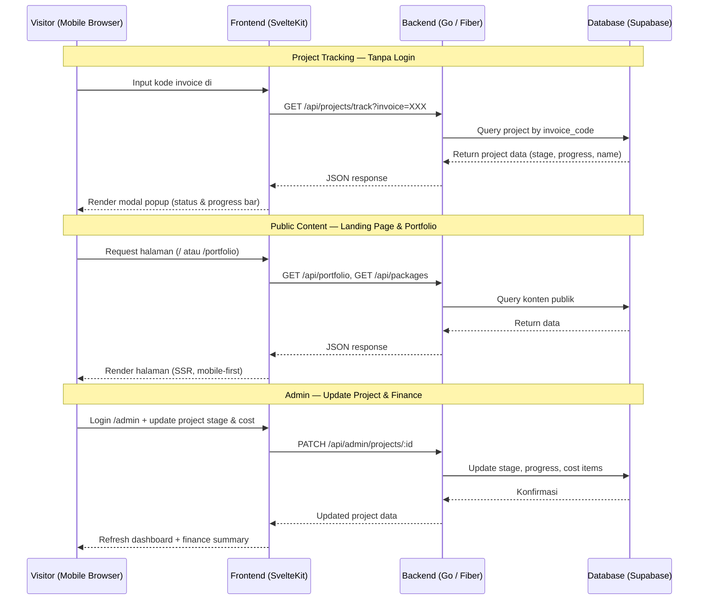
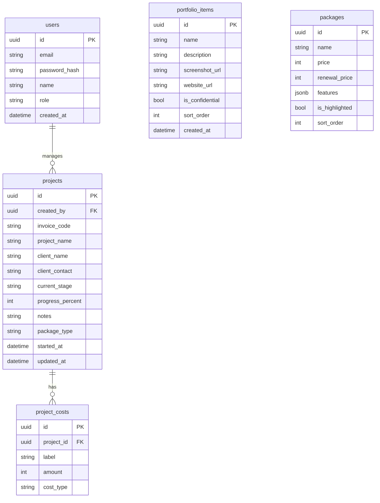

# PRD — Altertech Website Platform

## 1. Overview

Altertech membutuhkan platform web yang berfungsi ganda: sebagai **marketing landing page** untuk mengakuisisi klien baru (UMKM hingga korporasi), dan sebagai **platform operasional** yang memungkinkan klien aktif memantau progress project via kode invoice tanpa perlu login. Nilai utama yang dikomunikasikan adalah kecepatan eksekusi (1–2 hari kerja, go live maks. 7–10 hari kerja), teknologi yang tepat sasaran, dan kesiapan skala bisnis klien jangka panjang.

---

## 2. Requirements

- **Mobile-first:** Desain dan layout diprioritaskan untuk mobile, kemudian di-scale ke desktop.
- **Aksesibilitas:** Responsive penuh di semua ukuran layar (mobile, tablet, desktop); dioptimalkan untuk Chrome/Safari/Firefox terbaru.
- **Pengguna:** Dua role — Visitor (publik, tanpa login) dan Admin (Altertech internal, full access).
- **SEO:** Proper OG tags, sitemap.xml, structured data (Organization + Service schema), meta per halaman.
- **Target SEO Keywords:**
  - `jasa pembuatan website` — volume tinggi, high-intent UMKM
  - `web agency Indonesia` — brand awareness, B2B korporasi
  - `jasa website murah profesional` — price-sensitive UMKM segment
  - `pembuatan website company profile` — use-case spesifik, conversion intent tinggi
  - `jasa web developer cepat` — differentiator utama Altertech (speed)
- **Performance:** Target Lighthouse score ≥ 90 untuk Performance & SEO.
- **Kontak:** CTA utama redirect ke WhatsApp `wa.me/6281399484916` dengan pre-filled message; tanpa form kontak.
- **Project Tracking:** Publik, tanpa login — klien input kode invoice di section khusus, muncul modal status project.
- **Halaman Publik:** Hanya 2 halaman — Landing Page (single-page, multi-section) dan halaman Portfolio terpisah.
- **Admin Panel:** Mengelola konten marketing (portofolio, paket harga) dan project management (status, keuangan) dalam satu dashboard.
- **Deployment:** Containerized via Docker, di-deploy di Dokploy.

---

## 3. Core Features

### 3.1 Landing Page (Single-page, Multi-section)

Satu halaman dengan navigasi anchor link di header. Klik nav menu mengarah ke section, bukan pindah halaman.

1. **#hero**
   - Tagline + sub-tagline value proposition.
   - CTA utama: "Konsultasi Gratis via WhatsApp" (sticky di header & di dalam hero).
   - Social proof ringkas: jumlah klien / project selesai.

2. **#layanan**
   - Deskripsi layanan per kategori.
   - CTA per layanan ke WhatsApp dengan pre-filled message spesifik.

3. **#keunggulan**
   - 3 pilar: lead time 1–2 hari kerja, teknologi tepat sasaran, siap eskalasi bisnis.
   - Tabel perbandingan Altertech vs kompetitor.

4. **#harga**
   - Tiga paket side-by-side:
     - **Starter:** Rp 800.000 | renewal Rp 600.000/thn
     - **Premium:** Rp 1.250.000+ | renewal mulai Rp 800.000/thn *(badge "POPULER")*
     - **Custom:** Rp 5.000.000+
   - Tabel fitur per paket.
   - CTA per paket ke WhatsApp.

5. **#maintenance**
   - Harga renewal per paket.
   - Rincian apa yang termasuk & tidak termasuk.
   - Tabel perbandingan: kelola sendiri vs pakai Altertech.
   - Edukasi singkat mengapa maintenance penting.

6. **#alur-kerja**
   - Timeline visual 5 tahap: Kualifikasi → Pre-Deal → DP → Produksi → Closing.
   - Keterangan: maks. 7–10 hari kerja dari deal hingga go live.

7. **#tracking**
   - Input field: "Masukkan Kode Invoice Anda"
   - Tombol Enter / Cari → API call ke backend.
   - Jika valid: modal popup tampil status project (nama project, tahap aktif, progress bar).
   - Jika tidak valid: error message inline.

8. **#portofolio-preview**
   - Grid preview 3–4 item terbaru dari portofolio.
   - CTA "Lihat Semua Portfolio" → `/portfolio`.
   - Trust signal: mention enterprise konfidensial (Petrokimia Gresik & HM Sampoerna).

### 3.2 Halaman Portfolio (`/portfolio`)

9. **Portfolio Grid**
   - Card grid: NDNE, Digiomandira, Asclepio, Sekardadung, Kebun Bibit Alamku Asri, Javameka.
   - Modal popup per card: screenshot, deskripsi singkat, link ke website klien.
   - Mention enterprise konfidensial sebagai trust signal terpisah (bukan card, tapi callout section).

### 3.3 Admin Panel (Login-gated, `/admin`)

10. **Dashboard Admin**
    - Ringkasan project aktif & selesai.
    - **Finance Summary:**
      - Total pendapatan (sum semua project fee).
      - Total pengeluaran (sum semua cost per project).
      - Laba bersih (pendapatan − pengeluaran).
      - Breakdown per bulan (chart).
      - List project dengan status pembayaran (DP / Lunas / Pending).

11. **Content Management**
    - CRUD portofolio (nama, screenshot, deskripsi, URL klien, is_confidential flag).
    - CRUD paket harga (nama, harga, fitur, status highlight).

12. **Project Management**
    - CRUD data project:
      - Kode invoice (auto-generate, unik).
      - Nama project & keterangan klien (nama, kontak — tanpa akun login klien).
      - Tahap aktif (Kualifikasi / Pre-Deal / DP / Produksi / Closing).
      - Progress percent (0–100%).
    - **Cost Breakdown per project:**
      - Fee developer — pilihan pre-set:
        - Starter: Rp 500.000
        - Premium: Rp 750.000
        - Custom: input manual
        - Other: ketik sendiri
      - Biaya hosting (default: Rp 0, bisa diisi).
      - Biaya domain (default: Rp 0, bisa diisi).
      - Biaya lainnya: tambah item dinamis (label + nominal).
    - Total cost & fee otomatis terhitung, masuk ke finance summary.

---

## 4. User Flow

### Visitor (Calon Klien)
1. Visitor landing di Landing Page via SEO / referral.
2. Scroll melewati section keunggulan, harga, alur kerja.
3. Klik CTA "Konsultasi Gratis" → redirect WhatsApp `wa.me/6281399484916` dengan pre-filled message.
4. Opsional: klik nav #portofolio-preview → lihat grid → klik "Lihat Semua Portfolio" → `/portfolio`.

### Visitor (Klien Aktif, Cek Progress)
1. Klien buka website, scroll ke section `#tracking`.
2. Input kode invoice yang diterima dari Altertech → klik Enter.
3. Modal muncul: nama project, tahap aktif, progress bar visual 5 tahap.
4. Klien tutup modal, tidak perlu login, tidak ada aksi lain.

### Admin (Internal Altertech)
1. Login di `/admin` dengan email + password.
2. Dashboard: cek finance summary + project aktif.
3. Buat project baru: isi kode invoice (auto), keterangan klien, paket, cost breakdown.
4. Update tahap project → otomatis terupdate saat klien input kode invoice.
5. Kelola portofolio & paket harga via content management.

---

## 5. Architecture

---

## 6. Database Schema

| Tabel | Deskripsi |
|---|---|
| **users** | Auth admin internal Altertech (satu atau beberapa akun admin) |
| **projects** | Data project per klien; `invoice_code` dipakai klien untuk tracking publik tanpa login |
| **project_costs** | Breakdown biaya per project: fee developer, hosting, domain, lainnya |
| **portfolio_items** | Master portofolio publik; `is_confidential` untuk enterprise tanpa card publik |
| **packages** | Master paket harga yang ditampilkan di landing page |

---

## 7. Design & Technical Constraints

### 7.1 Tech Stack

| Layer | Teknologi | Alasan |
|---|---|---|
| Frontend | SvelteKit | Lightweight, SSR built-in, performa mobile excellent, bundle size minimal |
| Backend | Go (Fiber) | High-throughput, low latency, cocok untuk API stateless & tracking endpoint publik |
| Database | Supabase (PostgreSQL) | Built-in Auth, Row Level Security, managed infra |
| Deployment | Docker + Dokploy | Full control infra, reproducible environment, self-hosted |

### 7.2 Brand Visual

| Token | Value |
|---|---|
| Primary | `#2596BE` |
| Background | `#FFFFFF` |
| Surface | `#F8FAFC` |
| Accent / Dark | `#0D2137` (Deep Navy) |
| Text Primary | `#0D2137` |
| Text Secondary | `#64748B` |

> **Catatan:** Tidak ada warna Teal terpisah. Primary `#2596BE` berfungsi sebagai warna brand utama untuk CTA, highlight, dan elemen interaktif.

### 7.3 Typography

- **Display / Heading:** `Plus Jakarta Sans` weight 700–800 — modern, regional-friendly, tidak generik.
- **Body:** `Plus Jakarta Sans` weight 400–500 — konsisten satu type family, lebih clean.

### 7.4 Animasi & Interaksi (Mobile-first)

- Scroll-triggered reveal (Intersection Observer API, CSS-only fallback).
- Hover states pada card portofolio dan paket harga (touch-friendly: tap highlight).
- Smooth scroll ke anchor section saat nav diklik.
- Modal tracking project: slide-up animation dari bawah (native mobile pattern).
- Progress tracker: animated step indicator (5 tahap, aktif di-highlight).
- Sticky header dengan CTA WhatsApp, collapse rapi di mobile.

### 7.5 SEO & Meta

- OG tags + Twitter Card per halaman (Landing Page & `/portfolio`).
- `sitemap.xml` auto-generated oleh SvelteKit.
- JSON-LD structured data: `Organization` + `Service`.
- Canonical URL setiap halaman.
- `robots.txt` — blok `/admin`.
- **Target keywords** ditanamkan di: `<title>`, `<meta description>`, H1, H2, dan alt text gambar.

### 7.6 Security

- Supabase Auth JWT untuk semua route `/admin/*`.
- Row Level Security (RLS) di Supabase: admin only bisa CRUD data sendiri.
- `/admin/*` redirect ke `/admin/login` jika tidak authenticated.
- Tracking endpoint publik (`/api/projects/track`) hanya expose field: `project_name`, `current_stage`, `progress_percent`. Tidak ada data klien yang bocor.
- CORS policy ketat di Go backend — whitelist domain `altertech.id`.
- Rate limiting di endpoint tracking: maks. 10 request/menit per IP.

---

## 8. Out of Scope (v1)

- Login / akun untuk klien.
- Notifikasi email / push ke klien.
- Upload file / dokumen.
- Payment gateway / invoice digital.
- Multi-bahasa.
- Blog / artikel.
- Laporan keuangan export (PDF/Excel).